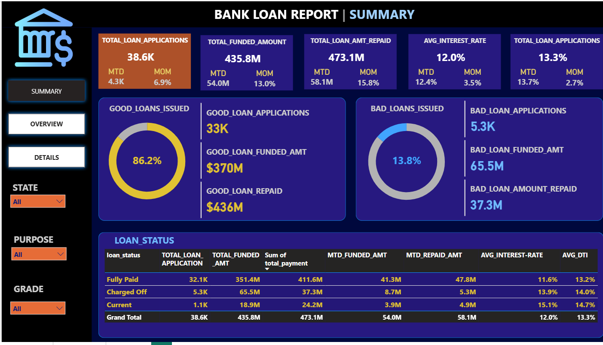
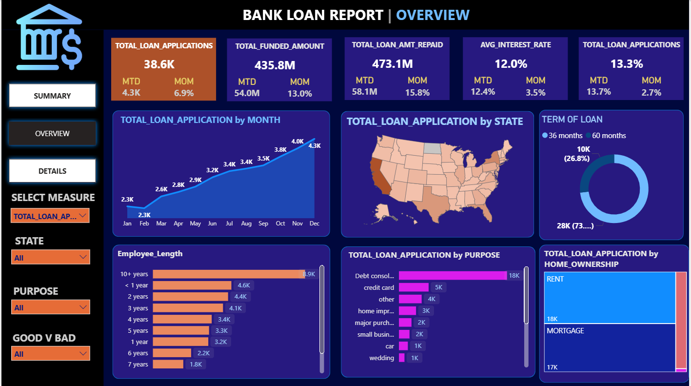
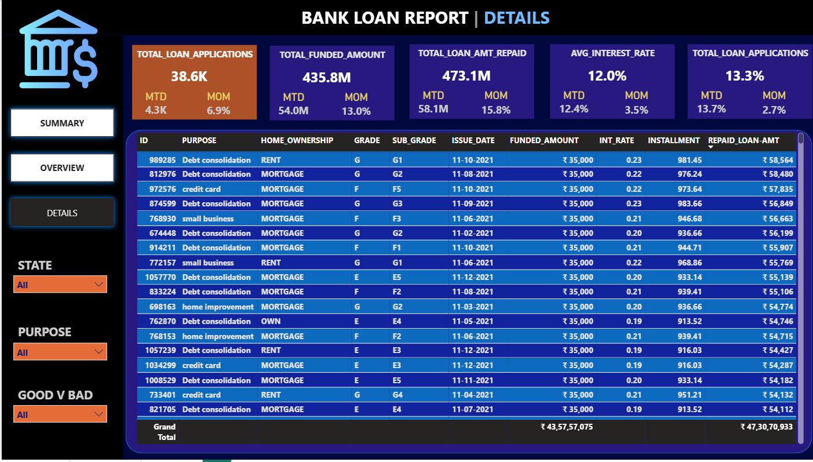

# 🏦 Bank Loan Report — Power BI Analytics Dashboard


> **A 3-page executive Power BI dashboard analysing 38,576 bank loan applications (2021) across good/bad loan classification, portfolio risk profiling, regional lending patterns, and borrower segmentation — validated against SQL queries for 100% data accuracy.**

---

## 📋 Table of Contents

- [Project Overview](#-project-overview)
- [Business Problem](#-business-problem)
- [Dataset Description](#-dataset-description)
- [Tools & Technologies](#️-tools--technologies)
- [Dashboard Pages](#-dashboard-pages)
- [Key KPIs & Metrics](#-key-kpis--metrics)
- [Key Findings](#-key-findings)
- [SQL Validation](#-sql-validation)
- [How to Run](#️-how-to-run)
- [Folder Structure](#-folder-structure)
- [Future Improvements](#-future-improvements)
- [Author](#-author)

---

## 🔍 Project Overview

This project builds a comprehensive **Bank Loan Report** for a fictional lending institution using Microsoft Power BI, covering the full year 2021 (38,576 loan applications). The report monitors portfolio health, tracks KPI trends month-over-month, distinguishes between Good and Bad loans, and provides drill-through analysis by state, purpose, grade, and borrower profile.

A distinguishing feature of this project is **SQL-based validation** — every Power BI KPI was independently verified against SQL queries to ensure data accuracy before publishing the dashboards.

---

## 💼 Business Problem

A bank's lending division needs a centralised reporting tool to:

1. **Monitor lending volume** — track total applications, funded amounts, and repayments on a rolling MTD/MoM basis
2. **Assess portfolio quality** — classify loans as Good (Fully Paid / Current) vs Bad (Charged Off) and measure their financial impact
3. **Profile borrower risk** — understand how grade, DTI, employment length, home ownership, and verification status relate to loan outcomes
4. **Identify regional patterns** — pinpoint states with high lending volume or elevated charge-off rates
5. **Support data-driven decisions** — give loan officers and management a single source of truth for strategy and risk management

---

## 📁 Dataset Description

| Column | Type | Description |
|---|---|---|
| `id` | Integer | Unique loan identifier |
| `address_state` | String | Borrower's US state (2-letter code) |
| `application_type` | String | Individual / Joint |
| `emp_length` | String | Employment tenure (< 1 year to 10+ years) |
| `emp_title` | String | Job title of borrower |
| `grade` / `sub_grade` | String | Risk grade A–G / A1–G5 assigned by lender |
| `home_ownership` | String | RENT / MORTGAGE / OWN / OTHER |
| `issue_date` | Date | Loan origination date |
| `loan_status` | String | **Target** — Fully Paid / Current / Charged Off |
| `purpose` | String | Loan purpose (debt consolidation, credit card, etc.) |
| `term` | String | 36 months / 60 months |
| `verification_status` | String | Not Verified / Source Verified / Verified |
| `annual_income` | Float | Borrower's self-reported annual income ($) |
| `dti` | Float | Debt-to-Income ratio |
| `installment` | Float | Monthly installment amount ($) |
| `int_rate` | Float | Loan interest rate (%) |
| `loan_amount` | Integer | Principal loan amount ($) |
| `total_payment` | Integer | Total amount received from borrower ($) |
| `total_acc` | Integer | Total number of credit accounts |

**Shape:** 38,576 rows × 24 columns | **Period:** January–December 2021

---

## 🛠️ Tools & Technologies

| Tool | Purpose |
|---|---|
| **Power BI Desktop** | Dashboard design, DAX measures, interactive visuals |
| **Microsoft Excel** | Raw data source and initial data review |
| **SQL (MS SQL Server)** | Independent KPI validation — all metrics cross-checked |
| **DAX** | Custom measures: MTD, PMTD, MoM%, Good/Bad loan KPIs |

---

## 📊 Dashboard Pages

### Page 1 — Summary

> KPI overview: $435.7M funded, 86.18% good loan rate,
> 13.82% charge-off rate. MTD December shows +13% MoM growth.

The executive summary page providing top-level KPIs with MTD and MoM tracking, plus the Good Loan vs Bad Loan split.

**KPIs tracked:**
- Total Loan Applications (MTD + MoM%)
- Total Funded Amount (MTD + MoM%)
- Total Amount Received (MTD + MoM%)
- Average Interest Rate (MTD + MoM%)
- Average DTI (MTD + MoM%)
- Good Loan vs Bad Loan classification panel
- Loan Status grid view

---

### Page 2 — Overview


> Visual breakdowns by month, state, purpose, grade,
> employment length, and home ownership.


Six visual breakdowns giving operational insight into lending patterns:

- **Line Chart** — Monthly loan applications, funded amount, and amount received by issue date
- **Filled Map** — Loan volume and funded amount by US state
- **Donut Chart** — Loan term distribution (36 vs 60 months)
- **Bar Chart** — Applications by employment length
- **Bar Chart** — Applications and funded amount by loan purpose
- **Tree Map** — Revenue by home ownership category

---

### Page 3 — Details


> Drill-through loan-level table filterable by any
> dashboard dimension.

A granular drill-through table providing individual loan-level data with all key fields, enabling loan officers to investigate specific records filtered by any dashboard dimension.

---

## 📈 Key KPIs & Metrics

### Portfolio Summary (Full Year 2021)

| KPI | Value |
|---|---|
| Total Loan Applications | 38,576 |
| Total Funded Amount | $435,757,075 |
| Total Amount Received | $473,070,933 |
| Net Portfolio Yield | +$37,313,858 (+8.56%) |
| Average Interest Rate | 12.05% |
| Average DTI | 13.3% |
| Average Loan Amount | $11,296 |
| Average Annual Income | $69,645 |

### MTD vs PMTD (December vs November 2021)

| Metric | MTD (Dec) | PMTD (Nov) | MoM Change |
|---|---|---|---|
| Applications | 4,314 | 4,035 | **+6.9%** ↑ |
| Funded Amount | $53,981,425 | $47,754,825 | **+13.0%** ↑ |
| Amount Received | $58,074,380 | $50,132,030 | **+15.8%** ↑ |

### Good Loan vs Bad Loan

| Category | Applications | % Share | Funded Amount | Amount Received |
|---|---|---|---|---|
| ✅ Good Loan (Fully Paid + Current) | 33,243 | **86.18%** | $370,224,850 | $435,786,170 |
| ❌ Bad Loan (Charged Off) | 5,333 | **13.82%** | $65,532,225 | $37,284,763 |

> Bad loans recovered only **$37.3M of $65.5M funded** — a net loss of **$28.2M** on charged-off accounts.

---

## 🔎 Key Findings

### Risk by Grade

| Grade | Count | Avg Interest Rate | Charge-Off Rate |
|---|---|---|---|
| A | 9,689 | 7.4% | 5.70% ✅ |
| B | 11,674 | 11.0% | 11.50% |
| C | 7,904 | 13.5% | 16.02% |
| D | 5,182 | 15.7% | 20.69% |
| E | 2,786 | 17.7% | 24.80% |
| F | 1,028 | 19.7% | 30.25% |
| G | 313 | 21.4% | 31.31% ⚠️ |

> Grade G loans charge off at **5.5× the rate of Grade A** loans, yet still represent 313 approved applications — a risk concentration worth monitoring.

### Risk by Purpose

| Purpose | Charge-Off Rate |
|---|---|
| Small Business | **25.62%** ⚠️ |
| Renewable Energy | 18.09% |
| Educational | 15.87% |
| Debt Consolidation | 14.55% |
| Home Improvement | 11.37% ✅ |

> Small business loans have the highest charge-off rate at 25.62% — nearly double the portfolio average of 13.82%.

### Risk by State (Top Charge-Off States, min. 200 loans)

| State | Loans | Charge-Off Rate |
|---|---|---|
| NV (Nevada) | 482 | **20.95%** |
| FL (Florida) | 2,773 | 17.27% |
| MO (Missouri) | 660 | 15.76% |
| CA (California) | 6,894 | 15.33% |

### Verification Paradox

| Status | Avg Loan | Charge-Off Rate |
|---|---|---|
| Not Verified | $8,485 | **12.24%** |
| Source Verified | $10,136 | 14.14% |
| Verified | $15,968 | **15.70%** |

> Verified borrowers have higher charge-off rates than unverified ones — likely because verification is triggered for higher-risk, higher-value loan applications. This is a useful nuance for risk model refinement.

### Monthly Growth Trend

Loan issuance grew consistently throughout 2021 — from 2,332 applications in January to 4,314 in December, a **+85% increase** over the year. Total funded amount grew from $25M in January to $54M in December.

---

## ✅ SQL Validation

All Power BI KPIs were independently calculated using SQL before being built into the dashboard. Key validated queries include:

```sql
-- Total Loan Applications
SELECT COUNT(id) AS Total_Applications FROM bank_loan_data

-- MTD Funded Amount (December)
SELECT SUM(loan_amount) AS MTD_Funded
FROM bank_loan_data WHERE MONTH(issue_date) = 12

-- Good Loan Percentage
SELECT
  (COUNT(CASE WHEN loan_status IN ('Fully Paid','Current') THEN id END) * 100.0)
  / COUNT(id) AS Good_Loan_Percentage
FROM bank_loan_data

-- Bad Loan Funded Amount
SELECT SUM(loan_amount) AS Bad_Loan_Funded
FROM bank_loan_data WHERE loan_status = 'Charged Off'

-- Grade-wise breakdown
SELECT grade, COUNT(id), SUM(loan_amount), AVG(int_rate)*100
FROM bank_loan_data GROUP BY grade ORDER BY grade
```

> Full SQL query document available at `docs/Query_Doc.docx`

---

## ▶️ How to Run

### Prerequisites
- [Power BI Desktop](https://powerbi.microsoft.com/desktop/) (free download)
- Microsoft Excel (to view raw data)

### Steps

1. Clone or download this repository
```bash
git clone https://github.com/YOUR_USERNAME/bank-loan-report.git
```

2. Open Power BI file
```
dashboard/BANK_LOAN_REPORT.pbix
```

3. If prompted to reconnect data source, point it to:
```
data/financial_loan_data_excel__2_.xlsx
```

4. Explore all 3 dashboard pages:
   - **Summary** — KPIs, MTD/MoM, Good vs Bad loans
   - **Overview** — Visual breakdowns by month, state, purpose, grade
   - **Details** — Drill-through loan-level table

---

## 📂 Folder Structure

```
bank-loan-report/
│
├── README.md
│
├── dashboard/
│   └── BANK_LOAN_REPORT.pbix          # Power BI interactive dashboard
│
├── data/
│   └── financial_loan_data_excel__2_.xlsx   # Raw loan data (38,576 records)
│
├── docs/
│   ├── Problem_Statement.docx          # Full KPI & dashboard requirements
│   └── Query_Doc.docx                  # SQL validation queries with outputs
│
└── screenshots/
    ├── dashboard_summary.png           # Page 1 — Summary KPIs
    ├── dashboard_overview.png          # Page 2 — Visual Overview
    └── dashboard_details.png           # Page 3 — Details drill-through
```

---

## 🔮 Future Improvements

- [ ] **Predictive default scoring** — integrate a Python ML model (Logistic Regression / XGBoost) to predict charge-off probability at origination
- [ ] **Automated refresh** — connect to a live SQL database instead of static Excel for real-time dashboard updates
- [ ] **Profitability analysis** — add net interest margin and loss-given-default (LGD) calculations per loan grade
- [ ] **Borrower cohort analysis** — track repayment behaviour over time by vintage (issue month)
- [ ] **Interactive What-If parameter** — allow users to simulate portfolio impact of tightening grade D/E/F approval criteria
- [ ] **Power BI Service publishing** — deploy to Power BI Service with row-level security for multi-user access

---

## 👤 Author

**Akileshwaran S** — Data Analyst | Power BI · SQL · Excel · Analytics

[](https://linkedin.com/in/YOUR_PROFILE)
[](https://github.com/YOUR_USERNAME)

---

*Part of a data analytics portfolio demonstrating Power BI dashboard development, DAX measure authoring, SQL validation methodology, and financial domain expertise in banking and credit risk.*
